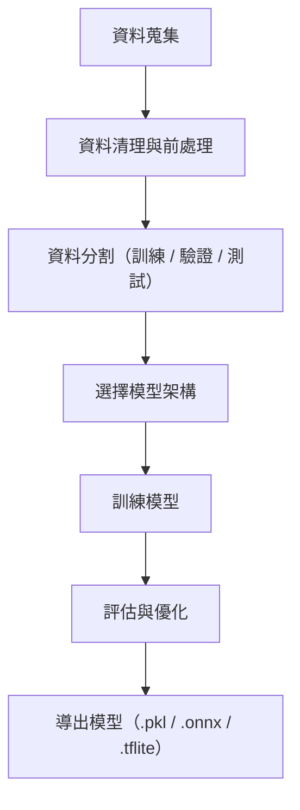

---

## 1️⃣ 什麼是模型訓練？

模型訓練是指：

> 利用已有的資料集，讓機器學習出資料間的關聯性與規律，以便未來能對新資料做出正確預測或分類。

簡單來說，就是「讓電腦學會從例子中做出決策」。

---

## 2️⃣ 模型訓練的基本流程

以下是開發導向的簡化訓練流程（適用於大多數 ML/AI 任務）：

---

## 3️⃣ 每個階段說明

### 🔹 資料蒐集

- 來源：問卷、感測器、API、開放資料、CRM 系統

- 依任務類型選擇資料（分類、迴歸、時間序列…）

### 🔹 資料前處理

- 缺失值處理、去除異常值

- 正規化（Normalization / Standardization）

- 類別轉換（One-hot、Label Encoding）

### 🔹 資料分割

- 通常採用：
    
    - 訓練集：70~80%
        
    - 驗證集：10~15%
        
    - 測試集：10~15%

### 🔹 選擇模型

依任務挑選模型類型，例如：

- 分類：Logistic Regression、Random Forest、XGBoost

- 迴歸：Linear Regression、Lasso、SVR

- 深度學習：CNN、RNN、Transformer

（可使用 scikit-learn、Keras、PyTorch、Hugging Face 等）

### 🔹 模型訓練

- 設定超參數（learning rate、epoch、batch size 等）

- 搭配 GPU/TPU 可加速訓練

### 🔹 模型評估

- 使用不同指標視任務類型：
    
    - 分類：Accuracy、F1、AUC
        
    - 迴歸：MAE、RMSE、R²

- 驗證集 → 優化參數；測試集 → 評估泛化能力

### 🔹 模型導出

- 導出格式根據用途：
    
    - `.pkl`（Python pickle，適合 scikit-learn）
    
    - `.h5` / `.tflite`（TensorFlow 用於部署）
    
    - `.onnx`（跨平台模型格式）

---

## 4️⃣ 常見模型訓練工具與平台

|工具 / 平台|特點|
|---|---|
|scikit-learn|傳統 ML 工具箱，適合初學者|
|TensorFlow / Keras|支援深度學習，部署彈性高|
|PyTorch|研究/開發界主流，彈性強|
|Hugging Face|預訓練模型平台，支援 NLP / CV|
|Google Colab|免費 GPU，快速試驗|
|Kaggle Notebook|整合資料集與訓練環境|

---
## 5️⃣ 非資料科學角度的訓練思維

- 💡 **你不一定要寫模型架構**，可以使用預訓練模型再訓練（Fine-tuning）

- 📦 **資料品質比演算法更關鍵**

- 🔄 **可以反覆調整資料與模型以獲得最佳效果**

- 🚀 **不用 GPU 也能做基本訓練**（小型模型）

---

## 🔗 延伸閱讀

- [[014.8-AI應用-資料預測與模型推論]]
- [[014.13-AI應用-Hugging Face 平台與 Transformers 使用]]
- [[014.22-AI應用-本地 vs 雲端模型的實務選擇]]
- [scikit-learn 官方文件](https://scikit-learn.org/)
- [Hugging Face Transformers 教學](https://huggingface.co/docs/transformers/index)